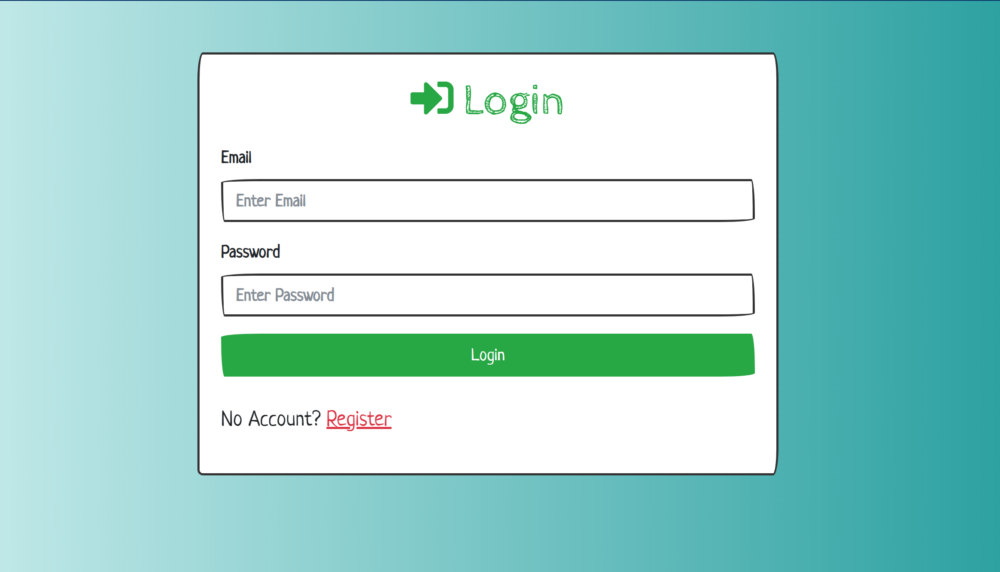

# Node Authentication App

> Membangun Register dan Login Authentication App berbasis NodeJS

Aplikasi ini menggunakan beberapa dependencies diantaranya:

- bcryptjs
- connect-flash
- ejs
- express
- express-ejs-layouts
- express-session
- method-override
- mongoose
- passport
- passport-local

## Demo

Demo aplikasi dapat diakses dengan link berikut: [Node Auth](https://rifandani-node-auth.now.sh/)

### Usage

```sh
npm install
```

```sh
$ npm start
# Atau jalankan dengan Nodemon
$ npm run dev

# Kunjungi http://localhost:5000
```

### MongoDB

Buka "config/keys.js" dan tambahkan MongoDB url anda sendiri
